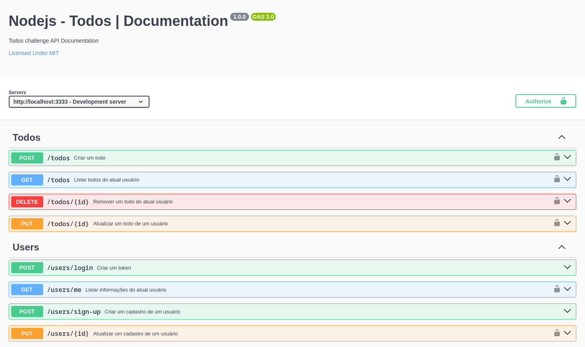

<div align="center">
  
</div>

# <div align="center"> # Desafio NodeJS 1 - todo </div>

#### <div align="right">- Projeto Finalizado <div>

<div align="center">
  
</div>

## Sobre

Desafio de curso criado pela equipe Rocketseat, nessa versão foram alterado as tecnologias para estudo

### Tecnologias Utilizadas

- [**ExpressJS**](https://expressjs.com/): Framework minimalista para aplicações Node.js, utilizado para criar e gerenciar rotas e middlewares com alta performance e flexibilidade.
- [**TypeScript**](https://www.typescriptlang.org/): Superset do JavaScript com tipagem estática, adotado no projeto para garantir maior segurança em tempo de desenvolvimento, facilitar refatorações e melhorar a escalabilidade do código.

- [**JSON Web Token (JWT)**](https://jwt.io/): Utilizado para a autenticação e autorização via tokens, permitindo sessões seguras e stateless na API.

- [**InversifyJS**](https://inversify.io/): Framework de Inversão de Controle (IoC) e Injeção de Dependência (DI), promovendo maior desacoplamento entre os módulos da aplicação e facilitando testes e manutenção.

- [**Swagger (OpenAPI)**](https://swagger.io/): Ferramenta para documentação automática da API REST, permitindo uma visualização clara dos endpoints, parâmetros e respostas disponíveis.

- [**bcrypt.js**](https://github.com/dcodeIO/bcrypt.js#readme): Biblioteca utilizada para hash e comparação de senhas, garantindo a proteção de dados sensíveis no processo de autenticação.

- [**Tsx**](https://tsx.is/): Runtime leve e moderno para execução de projetos TypeScript sem necessidade de transpilar manualmente, acelerando o desenvolvimento e simplificando o setup.

- [**Jest**](https://jestjs.io/pt-BR/): Framework de testes unitários amplamente utilizado na comunidade JavaScript/TypeScript, aplicado aqui para garantir a confiabilidade das regras de negócio.

- [**Supertest**](https://github.com/ladjs/supertest#readme): Ferramenta para testes de integração focada em APIs REST, utilizada para validar os endpoints em conjunto com o Jest.

- [**Zod**](https://zod.dev/): Biblioteca de validação e parsing de schemas, usada para garantir que os dados recebidos nas requisições estejam no formato esperado, promovendo segurança e previsibilidade.

## Requisitos

Para rodar a aplicação, você precisará instalar algumas ferramentas de desenvolvimento. As seguintes tecnologias foram utilizadas neste projeto:

- [Visual Studio Code](https://code.visualstudio.com/) ou outro editor de sua preferência
- [Node.js](https://nodejs.org/en/) para gerenciar as dependências e executar o código
- [Git](https://gitforwindows.org/) para baixar o repositório (se estiver no Windows)
- [yarn](https://yarnpkg.com/) gerenciador de pacotes
- [pnpm](https://pnpm.io/) gerenciador de pacotes

### Como Rodar a Aplicação

1. Clone o repositório:

   ```bash
    git clone https://github.com/Ricnaga/nodejs-todo
   ```

2. Acesse a pasta do projeto:

   ```bash
    cd nodejs-todo
   ```

3. Instale as dependências do projeto:

- Usando yarn, npm ou pnpm:

  ```bash
  $ yarn
  $ npm run install
  $ pnpm install
  ```

4. Inicie a aplicação:

   ```bash
   $ yarn dev
   $ npm run dev
   $ pnpm dev
   ```

O navegador abrirá automaticamente com a aplicação rodando em http://localhost:3333/swagger.

### Testes

```bash
$ yarn test
$ npm run test
$ pnpm test
```

Você pode verificar a cobertura dos testes no terminal ou acessando o arquivo index.html da pasta coverage que foi criada após executar o comando acima

## Contribuições

Se você deseja contribuir para o projeto, fique à vontade para enviar pull requests ou abrir issues.
