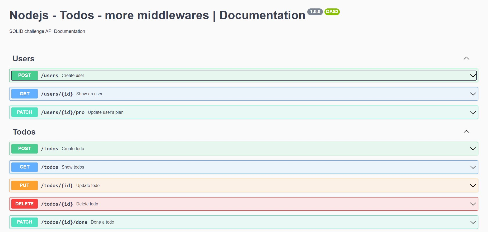

 



# <div align="center"> Desafio NodeJS 1 - todo </div>

#### <div align="right">- Projeto Finalizado <div>

### <div align="center"> Desafio de curso criado pela equipe Rocketseat abordando conceitos sobre: </div>

#### 1. CRUD com ExpressJS 
#### 2. Tipos de dados de requisições
#### 3. Tipos de dados de retornos
#### 4. Swagger


## <div align="center"> Sumário </div>
<!--ts-->
   - [Requisitos](#<div-align="center">Requisitos</div>)
   - [Tecnologias utilizadas](#<div-align="center">Tecnologias-utilizadas</div>)
<!--te-->

## <div align="center">Requisitos</div>
Para executar a aplicação é necessário instalar algumas ferramentas tais como um editor de códigos para realizar compilação dos mesmos. Nesse projeto foi utilizado o [Visual Studio Code](https://code.visualstudio.com/), [NodeJS](https://nodejs.org/en/) para compilação do código, [Git Bash](https://gitforwindows.org/) para baixar o repositório e baixar todas as dependências necessárias. Para realizar testes foi utilizado o [Insomnia](https://insomnia.rest/download/)

```bash
# Baixe o repositório.
$ git clone https://github.com/Ricnaga/nodejs-todo.git

# Acesse a pasta do projeto.
$ cd nodejs-todo

# Agora que baixou e acessou o repositório, vamos começar a instalação das dependências.
$ yarn ( caso não utilize o yarn execute apenas npm -i)

# Depois de instalado todas as dependências, abra a aplicação via vscode
$ code .

# Agore execute a aplicação.
$ yarn dev (caso não utilize o yarn: npm run dev)

# A aplicação iniciará na porta 3333 
# Acesse no navegador o endereço http://localhost:3333/swagger
```

##  <div align="center">Tecnologias utilizadas</div>
- [NodeJS](https://nodejs.org/en/)
- [Express](https://expressjs.com/pt-br/starter/installing.html)
- [Swagger](https://swagger.io/)


## <div align="center">Autor</div>
<div align="center">Atividade desenvolvida no curso ignite pela equipe <a href="https://rocketseat.com.br/">Rocketseat</a>, realizados por minha pessoa.
Gostou? tem alguma sugestão de melhoria? por favor, entre em contato e ja aproveita e me adiciona.<br>
<a href="https://www.linkedin.com/in/ricardo-nagatomy"></a>
<a href="https://app.rocketseat.com.br/me/ricardo-nagatomy"></a>
</div>
